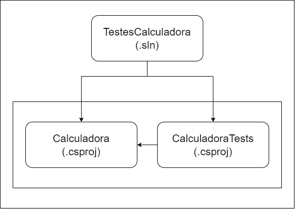

## Projeto Console, suas classes e métodos

O projeto consiste em uma Calculadora de Inteiros, fundamentado no método TDD.

**Classe ValidadorCalculadora**

Classe responsável por realizar os cálculos da calculadora, sempre recebendo dois números inteiros.

| Classe          | Método                       | Objetivo                                                                                                                |
|---------------- |------------------------------|-------------------------------------------------------------------------------------------------------------------------|
| ValidadorCalculadora | Somar      | Recebe dois inteiros, soma e salva a operação na Lista listaHistorico e retorna a soma dos valores                          |
| ValidadorCalculadora | Subtrair | Recebe dois inteiros, subtrai e salva a operação na Lista listaHistorico e retorna a subtração dos valores               |
| ValidadorCalculadora | Multiplicar      | Recebe dois inteiros, multiplica e salva a operação na Lista listaHistorico e retorna a multiplicação dos valores |
| ValidadorCalculadora | Dividir    | Recebe dois inteiros, divide e salva a operação na Lista listaHistorico e retorna a divisão dos valores                                                |
| ValidadorCalculadora | Historico     | Recebe a Lista listaHistorico e remove valores que estão acima da terceira posição, e retorna a lista (apenas os últimos 3 adicionados)                                                |

## Projeto do tipo teste, suas classes e métodos

**Classe ValidacoesListaTests**

Classe responsável por realizar os testes da classe ValidadorCalculadora.

| Classe               | Método de teste                               | Resultado esperado do teste
|----------------------|-----------------------------------------------|--------------------------------------------------------------------------------------------------------------------------------------------|
| ValidadorCalculadoraTests | DeveSomarDoisInteiros         | Ao passar vários elementos InLine, (dois inteiros e o resultado de sua soma) o resultado esperado deve ser igual ao passado pelo teste   |
| ValidadorCalculadoraTests | DeveSubtrairDoisInteiros                     | Ao passar vários elementos InLine, (dois inteiros e o resultado de sua subtração) o resultado esperado deve ser igual ao passado pelo teste                     |
| ValidadorCalculadoraTests | DeveMultiplicarDoisInteiros                 | Ao passar vários elementos InLine, (dois inteiros e o resultado de sua multiplicação) o resultado esperado deve ser igual ao passado pelo teste                       |
| ValidadorCalculadoraTests | DeveDividirDoisInteiros         | Ao passar vários elementos InLine, (dois inteiros e o resultado de sua divisão) o resultado esperado deve ser igual ao passado pelo teste                         |
| ValidadorCalculadoraTests | TestarDivisaoPorZero           | Testa se a divivisão por zero está retornando uma Exception                   |
| ValidadorCalculadoraTests | HistoricoNaoDeveSerVazio | Ao chamar vários métodos, não deve retornar uma lista vazia e apenas os últimos 3 resultados das operações realizadas (Length = 3)                 |

## Estrutura do projeto

